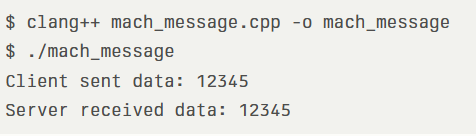
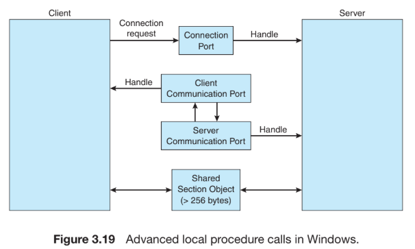
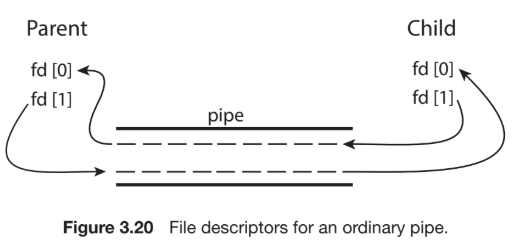

- Processes executing concurrently in the operating system may be either independent processes or cooperating processes. A process is independent if it does not share data with any other processes executing in the system. A process is cooperating if it can affect or be affected by the other processes executing in the system. Clearly, any process that shares data with other processes is a cooperating process.
- ***Cooperating processes*** require an **interprocess communication (IPC)** mechanism that will allow them to exchange data— that is, send data to and receive data from each other. There are ***two fundamental models*** of interprocess communication: **shared memory and message passing**.
- In the ***shared-memory model***, a region of memory that is shared by the cooperating
processes is established. Processes can then exchange information by reading and writing data to the shared region. In the ***message-passing model***, communication takes place by means of messages exchanged between the cooperating processes.
- 
- **Message passing** is useful for ***exchanging smaller amounts of data***, because ***no conflicts*** need be avoided. Message passing is also ***easier to implement in a distributed system than shared memory***.
- **Shared memory** can be ***faster than message passing***, since **message-passing systems are typically implemented using system calls** and thus require the more time-consuming task of kernel intervention. In shared-memory systems, ***system calls are required only*** to establish ***shared- memory regions***. Once shared memory is established, all accesses are treated as routine memory accesses, and no assistance from the kernel is required.
( continue from pg 126 of book)

## IPC in Message Passing System
Here are several ways for implementing logically, a link and the send()/recieve() operations:
- Direct or Indirect Communication
- Synchronous or Asynchronous Communication
- Automatic or Explicit Buffering

##### Naming
- Processes that want to communicate must have a way to refer to each other. They can use either **direct** or **indirect communication**.
- This scheme exhibits **symmetry in addressing**; that is, *both the sender process and the receiver process must name the other to communicate*.
    • send(P, message) — Send a message to process **P**.
    • receive(Q, message) — Receive a message from process **Q**.
- A communication link in this scheme has the following properties:
    • A link is established automatically between every pair of processes that want to communicate. The processes need to know only each other’s identity to communicate.
    • A link is associated with exactly two processes.
    • Between each pair of processes, there exists exactly one link.
    
- When **asymmetry in addressing**, only the *sender names
the recipient*; the *recipient is not required to name the sender*. In this scheme, the send() and receive() primitives are defined as follows:
    • send(P, message) — Send a message to process **P**.
    • receive(id, message) — Receive a message from **any process**. The variable id is set to the name of the process with which communication has taken place.

- The *disadvantage* in both of these schemes *(symmetric and asymmetric)* is the **limited modularity** of the resulting process definitions.
- With *indirect communication*, the messages are *sent to* and *received* from **mailboxes**, or **ports**.
- A process can *communicate* with another process *via a number of different mailboxes*, but ***two processes can communicate only if they have a shared mailbox***.
- Now how to restrict that if two processes have recieve() called, only one process access the mailbox??
    - Allow a link to be associated with two processes at most.
    - Allow at most one process at a time to execute a receive() operation.
    - Allow the system to select arbitrarily which process will receive the message (that is, either P2 or P3, but not both, will receive the message). The system may define an algorithm for selecting which process will receive the message (for example, round robin, where processes take turns receiving messages). The system may identify the receiver to the sender.

##### Synchronization
- Message passing may be either blocking or nonblocking— also known as synchronous and asynchronous.
    • Blocking send. The sending process is blocked until the message is received by the receiving process or by the mailbox.
    • Nonblocking send. The sending process sends the message and resumes operation.
    • Blocking receive. The receiver blocks until a message is available.
    • Nonblocking receive. The receiver retrieves either a valid message or a null.

##### Buffering
- Whether communication is ***direct or indirect***, messages exchanged by communicating processes reside in a **temporary queue**.
- Basically, such queues can be implemented in *three ways*:
    • **Zero capacity.** The *queue has a maximum length of zero*; thus, the link cannot have any messages waiting in it. In this case, the sender must block until the recipient receives the message.
    • **Bounded capacity.** The *queue has finite length n*; thus, at most n messages can reside in it. If the queue is not full when a new message is sent, the ***message is placed in the queue (either the message is copied or a pointer to the message is kept)***, and the sender can continue execution without waiting. The link’s capacity is finite, however. If the ***link is full, the sender must block until space is available in the queue***.
    • **Unbounded capacity.** The *queue’s length is potentially infinite*; thus, any number of messages can wait in it. ***The sender never blocks.***
- The ***zero-capacity*** case is sometimes referred to as a ***message system with no buffering***. The *other cases* are referred to as ***systems with automatic buffering***.

## Examples of IPC Systems
1. **POSIX Shared Memory**
- POSIX shared memory is organized using memory-mapped files, which associate the region of shared memory with a file. 
- A process must first create a shared-memory object using the shm open() system call, as follows:
```
fd = shm open(name, O CREAT | O RDWR, 0666);
```
- The first parameter specifies the name of the shared-memory object. Processes that wish to access this shared memory must refer to the object by this name.
- The subsequent parameters specify that the shared-memory object is to be created if it does not yet exist (O CREAT) and that the object is open for reading and writing (O RDWR).
- The last parameter establishes the file-access permissions of the shared-memory object. A successful call to shm open() returns an integer file descriptor for the shared-memory object.
- The call *ftruncate(fd, 4096);* sets the size of the object to 4,096 bytes.
- Finally, the mmap() function establishes a memory-mapped file containing the shared-memory object. It also returns a pointer to the memory-mapped file that is used for accessing the shared-memory object.

##### Notes for the code file execution (if the code is implemented as in Galvin, that is, separate files):
- Order of Execution: Always run producer first so the shared memory object exists for the consumer to read.

Permissions and Cleanup: The consumer is responsible for removing the shared memory object via shm_unlink(name) after use.​

Libraries: -lrt is required for POSIX realtime extensions (shared memory operations). Use g++ for C++ code,

##### notes for producerConsumerSharedMemory.cpp file
- **Single File, Forking:**
    - Your code handles both producer (parent) and consumer (child) ***in one source file by forking the process***.
- **Shared Memory Creation:** 
    - Defines a ***shared memory object name*** (e.g., */posix_shm_example)* and *size (4096 bytes)*.
    - Calls *shm_open with O_CREAT | O_RDWR* to ***create/open a new POSIX shared memory object***. 
    - Sets the ***size*** using *ftruncate*.
- **Memory Mapping:**
    - Uses mmap to map the shared memory object to the process’s address space with both read and write permissions.
- **Process Forking:** 
    - fork() is called to create a child process.
- **Parent Process:**
    - Writes "Hello from parent via POSIX shared memory!" into the shared memory using *sprintf*.
    - Prints a confirmation message.
- **Child Process:**
    - ***Waits a second (sleep(1))*** to allow the parent to write.
    - Reads from shared memory and prints the message. 
    - It ***also unlinks*** (removes) the shared memory object: unmaps and closes the shared memory, and calls shm_unlink to remove it from the system.
- **Process Synchronization:**
    - Parent waits for the child to finish with *wait(NULL)*.

##### notes for producerConsumerMssgPassing.cpp file
- **Pipe Creation:**
    - Defines a ***2-element integer array***, *pipefd[2]*.
    - Calls *pipe()* to ***create the pipe***.
- **Process Forking & Roles:**
    - *First fork()* creates the producer process **(child)**.
    - *Second fork()* (in the parent) creates the consumer process **(other child)**.
- **Producer Process:**
    - Responsible for writing integers (from 1 to 10) into the pipe using *write()*.
    - Prints a confirmation after each write.
    - Closes the write end when done.
- **Consumer Process:**
    - Reads integers from the pipe using *read()* and prints them.
    - Sleeps 1 second per read for clear output sequencing.
    - Closes the read end when done.
- **Parent Process:**
    - Closes both ends of the pipe after child processes are forked.
    - Waits for both children to finish using *wait(NULL)*.

2. **Mach Message Passing**

##### notes for MachMsgPassing.cpp file
- output 
- ***Platform:*** *Only works on macOS or Mach-based systems, not on Linux.*
- ***Headers Needed:*** *\< mach/mach.h \>*
- ***Link with:*** *No need for special linker flags on macOS*, but root/admin privileges may be necessary.

3. **Windows**
- The message-passing facility in Windows is called the ***advanced local procedure call (ALPC) facility***.
- It is used for communication between two processes on the same machine. It is similar to the ***standard remote procedure call (RPC) mechanism*** that is widely used, but it is optimized for and specific to Windows.
- Windows uses two types of ports: **connection ports** and **communication ports** to *establish and maintain a connection between two processes*.
- Server processes *publish connection-port objects* that are visible to all processes. When a client wants services from a subsystem, it *opens a handle to the server’s connection-port object* and *sends a connection request to that port*.
- The server then creates a *channel and returns a handle to the client*. The channel consists of a pair of private communication ports: one for client–server messages, the other for server–client messages. Additionally, communication channels support a callback mechanism that allows the client and server to accept requests when they would normally be expecting a reply.
- 

- When an *ALPC channel is created*, one of three message-passing techniques is chosen:
    1. For **small messages** (up to 256 bytes), the *port’s message queue* is used as *intermediate storage*, and the messages are copied from one process to the other.
    2. **Larger messages** must be passed through a section object, which is a *region of shared memory* associated with the channel.
    3. When the amount of data is too large to fit into a section object, an API is available that allows server processes to read and write directly into the address space of a client.
- It is important to note that the *ALPC facility in Windows* is ***not part of the Windows API*** and hence is *not visible to the application programmer*. Rather, applications using the Windows API invoke standard remote procedure calls. When the RPC is being invoked on a process on the same system, the ***RPC is handled indirectly through an ALPC procedure call***. Additionally, many kernel services use ALPC to communicate with client processes.

4. **Pipes**
- A pipe acts as a conduit allowing two processes to communicate. Pipes were one of the first IPC mechanisms in early UNIX systems. They typically provide one of the simpler ways for processes to communicate with one another, although they also have some limitations. In ***implementing a pipe, four issues*** must be considered:
    - 1. Does the *pipe allow bidirectional communication*, or is communication unidirectional?
    - 2. If *two-way communication* is allowed, is it *half duplex* (data can travel ***only one way at a time***) or *full duplex* (data can travel in ***both directions at the same time***)? Note the diff between *bidirectional communication VS two-way communication*.
    - 3. Must a relationship (such as *parent–child*) exist between the communicating processes?
    - 4. Can the pipes communicate over a network, or must the communicating processes reside on the same machine?
- In the following sections, we explore two common types of pipes used on both
UNIX and Windows systems: ordinary pipes and named pipes.

##### 1. Ordinary Pipes
- Ordinary pipes allow two processes to communicate in standard producer–consumer fashion: the ***producer writes to one end of the pipe*** (the write end) and the ***consumer reads from the other end*** (the read end). As a result, **ordinary pipes are unidirectional**, allowing only one-way communication. If two-way communication is required, two pipes must be used, with each pipe sending data in a different direction.
- On UNIX systems, ordinary pipes are constructed using the function
```
pipe(int fd[])
```
- This function creates a pipe that is accessed through the *int fd[]* file descriptors: *fd[0]* is the read end of the pipe, and *fd[1]* is the write end. UNIX treats a pipe as a special type of file. Thus, pipes can be accessed using ordinary *read()* and *write()* system calls.
- An ordinary pipe cannot be accessed from outside the process that created it. Typically, a parent process creates a pipe and uses it to communicate with a child process that it creates via *fork()*.
- 

##### Notes for the codefile pipe_example.cpp
- **Pipe Creation:**
    - *pipe(fd)* creates a ***unidirectional pipe***. *fd[READ_END]* is for reading and *fd[WRITE_END]* is for writing.
- **Process Forking:**
    - *fork()* creates a ***parent and child process***. The parent will send a message; the child will receive it.
- **Parent Process:**
    - Closes unused read end: *close(fd[READ_END])*.
    - Writes the string "Greetings" to the pipe: *write(fd[WRITE_END]*, *write_msg*, *strlen(write_msg)+1)*;.
    - Closes write end of pipe after sending: *close(fd[WRITE_END])*.
- **Child Process:**
    - Closes unused write end: *close(fd[WRITE_END])*.
    - Reads the message from the pipe into read_msg: *read(fd[READ_END]*, *read_msg*, *BUFFER_SIZE*);.
    - Prints the received message: *std::cout << "read: " << read_msg << std::endl;*.
    - Closes the read end after reading: *close(fd[READ_END])*;.
##### 2. Named Pipes
- Ordinary pipes provide a simple mechanism for allowing a pair of processes to communicate. However, ***ordinary pipes exist only while the processes are communicating with one another***. On both UNIX and Windows systems, once the processes have finished communicating and have terminated, the *ordinary pipe ceases to exist*.
- *Named pipes* provide a ***much more powerful communication tool***. Communication can be *bidirectional*, and no parent–child relationship is required.
- Once a named pipe is established, several processes can use it for communication. In fact, in a *typical scenario*, a **named pipe has several writers**. Additionally, ***named pipes continue to exist*** after *communicating processes have finished*.
- Both UNIX and Windows systems support named pipes, although the details of implementation differ greatly. Next, we explore named pipes in each of these systems.
- *Named pipes* are referred to as ***FIFOs in UNIX systems***. Once created, they appear as typical files in the file system. A FIFO is created with the mkfifo() system call and manipulated with the ordinary open(), read(), write(), and close() system calls.