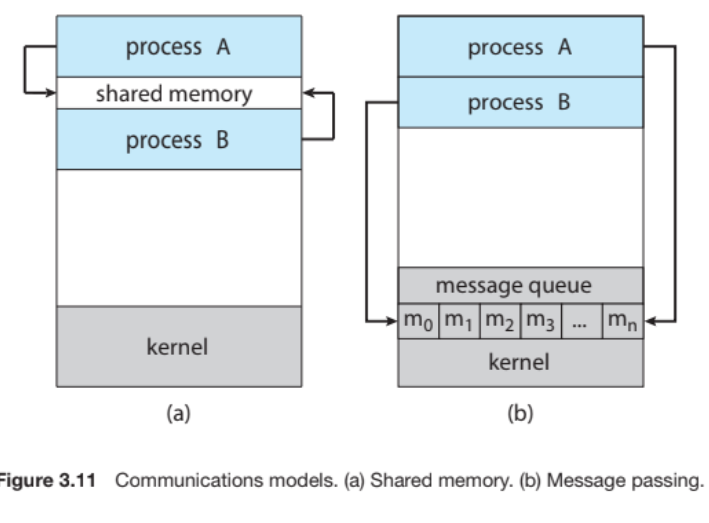

- Processes executing concurrently in the operating system may be either independent processes or cooperating processes. A process is independent if it does not share data with any other processes executing in the system. A process is cooperating if it can affect or be affected by the other processes executing in the system. Clearly, any process that shares data with other processes is a cooperating process.
- ***Cooperating processes*** require an **interprocess communication (IPC)** mechanism that will allow them to exchange data— that is, send data to and receive data from each other. There are ***two fundamental models*** of interprocess communication: **shared memory and message passing**.
- In the ***shared-memory model***, a region of memory that is shared by the cooperating
processes is established. Processes can then exchange information by reading and writing data to the shared region. In the ***message-passing model***, communication takes place by means of messages exchanged between the cooperating processes.
- 
- **Message passing** is useful for ***exchanging smaller amounts of data***, because ***no conflicts*** need be avoided. Message passing is also ***easier to implement in a distributed system than shared memory***.
- **Shared memory** can be ***faster than message passing***, since **message-passing systems are typically implemented using system calls** and thus require the more time-consuming task of kernel intervention. In shared-memory systems, ***system calls are required only*** to establish ***shared- memory regions***. Once shared memory is established, all accesses are treated as routine memory accesses, and no assistance from the kernel is required.
( continue from pg 126 of book)