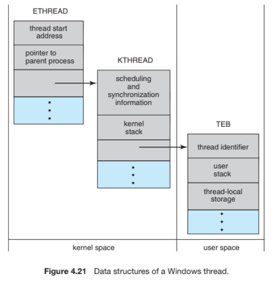

>Scope Contention
>LWP (Light Weight Process)
- On systems implementing the many-to-one and many-to-many models, the thread library schedules user-
level threads to run on an available LWP.
- This scheme is known as process-contention scope (PCS), since competition for the CPU takes place among threads belonging to the same process.
- To decide which kernel-level thread to schedule onto a CPU, the kernel uses system-contention scope (SCS). - Competition for the CPU with SCS scheduling takes place among all threads in the system. Systems using the one-to-one model, such as Windows and Linux schedule threads using only SCS.

---

## Threads
-> A **thread library provides** the programmer with an **API for creating and managing threads**.  
    
-> There are two primary ways of implementing a thread library.
    
-> The ***first approach*** is to provide a **library entirely in user space with no kernel support**. All code and data structures for the library exist in user space. This means that invoking a function in the library results in a local function call in user space and not a system call.
    
-> The ***second approach*** is to implement a **kernel-level library supported directly by the operating system**. In this case, code and data structures for the library exist in kernel space. Invoking a function in the API for the library typically results in a system call to the kernel.
    
-> **Three main thread libraries** are in use today: **POSIX Pthreads, Windows, and Java.** 

-> Pthreads, the threads *extension of the POSIX standard*, may be provided as *either a user-level* or a *kernel-level* library.

-> The Windows thread library is a *kernel-level library* available on Windows systems.

-> The Java thread API allows threads to be created and managed directly in *Java programs*.
    
-> However, because in most instances the JVM is running on top of a host operating system, the **Java thread API is generally implemented** using a **thread library** available on the **host system**. This means that on **Windows systems, Java threads are typically implemented using** the ***Windows API; UNIX, Linux, and macOS systems.*** typically use Pthreads.
-> For POSIX and Windows threading, any data declared globally — that is, declared outside of any function — are shared among all threads belonging to the same process. Because Java has no equivalent notion of global data, access to shared data must be explicitly arranged between threads.

-> *Two general strategies for creating multiple threads*: **asynchronous threading** and **synchronous threading**. 
-> With asynchronous threading, once the parent creates a child thread, the **parent resumes its execution**, so that the **parent and child execute concurrently and independently** of one another. Because the threads are independent, there is typically **little data sharing** between them. Asynchronous threading is the strategy used in the multithreaded server illustrated in Figure 4.2 and is also commonly used for designing responsive user interfaces.
-> Synchronous threading occurs when the **parent thread creates one or more children and then must wait for all of its children to terminate before it resumes**. Here, the *threads created by the parent perform work concurrently*, **but the parent cannot continue until this work has been completed**. Once each thread has finished its work, it terminates and joins with its parent. Only after all of the children have joined can the parent resume execution. Typically, synchronous threading involves **significant data sharing among threads**. For example, the parent thread may combine the results calculated by its various children.
    
#### 1. Pthreads
1. POSIX Threads (Pthreads) specification is like the abstraction layer or interface (API) for threading in C and C++.
2. Pthreads refers to the POSIX standard (IEEE 1003.1c) defining an API for thread creation and synchronization. This is a specification for thread behavior, not an implementation.
3. Many UNIX-like systems, such as Linux and macOS, include built-in support for the Pthreads specification. Windows does not support Pthreads by default, but there are some third-party libraries that make it possible to use Pthreads on Windows.
4. All Pthreads programs must include the pthread.h header file.
5. Each thread has a set of attributes, including stack size and scheduling information.
6. Synchronization mechanism:
a) MUTEX LOCKS: When a thread wants to access a shared resource, it must first acquire the associated mutex - if the mutex is already locked by another thread, the requesting thread enters a waiting state until the lock becomes available.
b) Semaphores (signalling concept)

#### 2. Windows Thread
1. We must include the
windows.h header file when using the Windows API.
2. 

#### 2. Java Threads
1. *All Java programs* comprise **at least a single thread of control** — even a simple Java program consisting of only a main() method runs as a single thread in the JVM.
2. There are **two techniques for explicitly creating threads in a Java** program.
3.(a) One approach is to **create a new class that is derived from the Thread class** and to *override its run() method*. 
3.(b) An alternative — and *more commonly* used — technique is to **define a class that implements the Runnable interface**. 
4. This interface defines a single abstract method with the signature public void run(). 
5. The code in the run() method of a class that implements Runnable is what executes in a separate thread. 
6. An example is shown below: class Task implements Runnable
```
{
    public void run() {
        System.out.println("I am a thread.");
    }
}
```    
7. *Invoking the **start() method*** for the **new Thread object** does two things:
    - 1. It **allocates memory** and **initializes a new thread in the JVM**.
    - 2. It *calls the run() method*, making the **thread eligible to be run by the JVM**.
(Note again that we *never call the run() method directly*. Rather, **we call the start() method, and it calls the run() method** on our behalf.)
8. Recall that the **parent threads in the Pthreads and Windows libraries** use ***pthread join()*** and ***WaitForSingleObject()*** (respectively) **to wait for the summation threads to finish before proceeding**. 
9. The ***join() method in Java*** provides similar functionality. (***Notice*** that **join() can throw an InterruptedException**, which we choose to ignore.)   
```
try {
    worker.join();
}
catch (InterruptedException ie) { }
```
10. Classes implementing this interface must define the *execute() method*, which is passed a *Runnable object*. 
11. For Java developers, this means **using the Executor rather than creating a separate Thread object and invoking its start() method**. 
12. The Executor is used as follows:
```
Executor service = new Executor;
service.execute(new Task());
```
13. The **Executor framework** is based on the **producer-consumer model**;
14. The **advantage** of this approach is that **it not only divides thread creation from execution** but also **provides a mechanism for communication between concurrent tasks**.
15. **Data sharing between threads belonging to the same process** occurs *easily in Windows and Pthreads*, since shared data are simply declared *globally*. As a pure object-oriented language, *Java has no such notion of global data*. We can pass parameters to a class that implements Runnable, but **Java threads cannot return results**. 
16. To address **this** need, the java.util.concurrent package additionally defines the **Callable interface**, which behaves similarly to Runnable except that a ***result can be returned***. Results returned from Callable tasks are known as **Future objects**. A result can be retrieved from the **get() method** defined in the Future interface.
17. (The primary *difference between the execute() and submit()* methods is that the **former returns no result**, whereas the **latter returns a result as a Future**.)

-> **Implicit Threading** : One way to address the difficulties and better support the design of con-
current and parallel applications (with hundreds and even thousands of threads looming to run concurrently) is to *transfer the creation and management* of threading **from application developers to compilers and run-time libraries**.
-> This strategy, termed implicit threading, is an increasingly popular trend. The **advantage** of this approach is that ***developers only need to identify parallel tasks***, and the ***libraries determine the specific details of thread creation and management***.
-> **A multithreaded web server**:  In this situation, whenever the server receives a request, it creates a separate thread to service the request. Whereas ***creating a separate thread is certainly superior to creating a separate process***, a multithreaded server nonetheless has potential problems.
-> The *first issue* concerns the **amount of time required to create the thread**,
together with the fact that the **thread will be discarded once it has completed its work**. The *second issue* is more troublesome. If we allow each concurrent request to be serviced in a new thread, we have not placed a **bound on the number of threads concurrently active** in the system. **Unlimited threads could exhaust system resources, such as CPU time or memory**. One ***solution*** to this problem is to use a **thread pool**.
-> *WORKING*: When a server receives a request, rather than creating a thread, it instead submits the request to the thread pool and resumes waiting for additional requests. If there is an available thread in the pool, it is awakened, and the request is serviced immediately. If the pool contains no available thread, the task is queued until one becomes free. Once a thread completes its service, it returns to the pool and awaits more work. ***Thread pools work well when the tasks submitted to the pool can be executed asynchronously***.
-> Thread pools offer these *BENEFITS*:
    1. Servicing a request with an existing thread is often faster than waiting to create a thread.
    2. A thread pool limits the number of threads that exist at any one point. This is particularly important on systems that cannot support a large number of concurrent threads.
    3. Separating the task to be performed from the mechanics of creating the task allows us to use different strategies for running the task. For example, the task could be scheduled to execute after a time delay or to execute periodically.

-> **Threading Issues** : 
        1. ***The fork() and exec() Sys Calls***
        - The semantics of the fork() and exec() system calss change in a multithreaded program.
        - If one thread in a program calls fork(), does the new process duplicate all threads, or is the new process single-threaded? Some UNIX systems have chosen to have two versions of fork(), one that duplicates all threads and another that duplicates only the thread that invoked the fork() system call.
        - The exec() system call typically works in the same way, that is, if a thread invokes the exec() system call, the program specified in the parameter to exec() will replace the entire process—including all threads.
        - Which of the two versions of fork() to use depends on the application. If exec() is called immediately after forking, then duplicating all threads is unnecessary, as the program specified in the parameters to exec() will replace the process. In this instance, duplicating only the calling thread is appropriate. If, however, the separate process does not call exec() after forking, the separate process should duplicate all threads.    
        2. ***Signal Handling***
        - A signal is used in UNIX systems to notify a process that a particular event has occurred.
        -   1. A signal is generated by the occurrence of a particular event.
            2. The signal is delivered to a process.
            3. Once delivered, the signal must be handled.
        - A signal may be handled by one of two possible handlers:
            1. A default signal handler
            2. A user-defined signal handler
        3. ***Thread Cancellation***
        - Thread cancellation involves terminating a thread before it has completed.
        - A thread that is to be canceled is often referred to as the **target thread**.
        - Cancellation of a target thread may occur in two different scenarios:
            1. ***Asynchronous cancellation***. One thread immediately terminates the target thread.
            2. ***Deferred cancellation***. The target thread periodically checks whether it should terminate, allowing it an opportunity to terminate itself in an orderly fashion.

-> We ***conclude the chapter*** by exploring how threads are implemented in Windows and Linux systems.
    - 1. **Window Threads** : 
        - A Windows application runs as a separate process, and each process may contain one or more threads. The Windows API for creating threads is covered in Section 4.4.2. Additionally,Windows uses the one-to-one mapping described in Section 4.3.2, where each user-level thread maps to an associated kernel thread.
        - The general components of a thread include:
            • A thread ID uniquely identifying the thread
            • A register set representing the status of the processor
            • A program counter
            • A user stack, employed when the thread is running in user mode, and a kernel stack, employed when the thread is running in kernel mode
            • A private storage area used by various run-time libraries and dynamic link libraries (DLLs).
        - The register set, stacks, and private storage area are known as the context of the thread. The primary data structures of a thread include:
            • ETHREAD—executive thread block
            • KTHREAD—kernel thread block
            • TEB— thread environment block
        - 
        - The KTHREAD includes scheduling and synchronization information for the thread. In addition, the KTHREAD includes the kernel stack (used when the thread is running in kernel mode) and a pointer to the TEB. The ETHREAD and the KTHREAD exist entirely in kernel space; this means that only the kernel can access them. The TEB is a user-space data structure that is accessed when the thread is running in user mode. Among other fields, the TEB contains the thread identifier, a user-mode stack, and an array for thread-local storage.
    - 2. **Linux Threads** :
        - Linux provides the fork() system call with the traditional functionality of duplicating a process, as described in Chapter 3. Linux also provides the ability to create threads using the clone() system call. However, Linux does not distinguish between processes and threads. In fact, Linux uses the term task — rather than process or thread — when referring to a flow of control within a program.
        - Using clone() in this fashion is equivalent to creating a thread as described in this chapter, since the parent task shares most of its resources with its child task. However, if none of these flags is set when clone() is invoked, no sharing takes place, resulting in functionality similar to that provided by the fork() system call.
